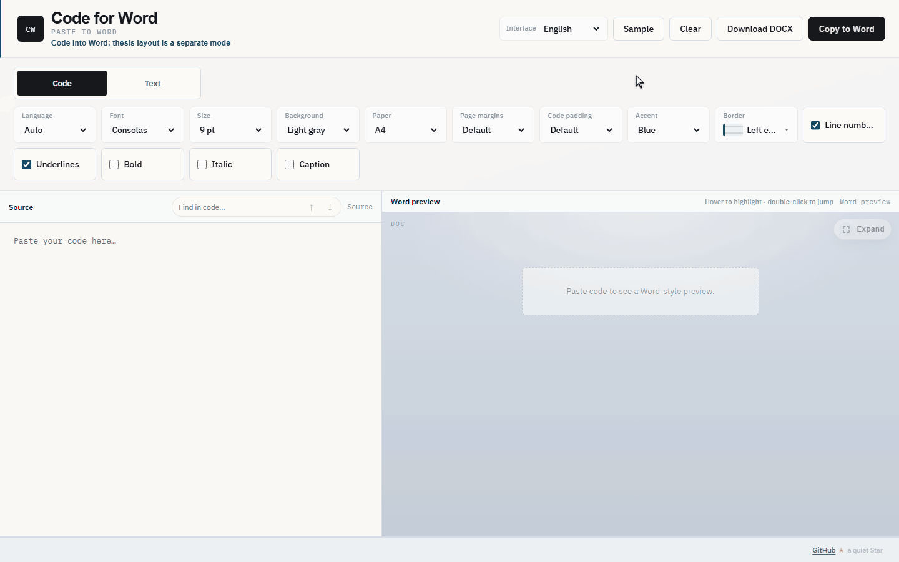

# Code for Word · 码文

**English** | [中文](./README.zh-CN.md)

<p align="center">
  <a href="https://github.com/L00PLeGeNd/code-for-word/stargazers"></a>
  <a href="https://github.com/L00PLeGeNd/code-for-word/releases/latest"></a>
  <a href="https://l00plegend.github.io/code-for-word/"></a>
  <a href="https://gitee.com/loopisme/code-for-word"></a>
  <a href="./LICENSE"></a>
</p>

<p align="center">
  
</p>

**Paste highlighted code into Word** — colors, frame, margins, and optional caption rows stay put. That is the main job. An optional **text mode** can set prose like a thesis; the app always opens in code mode.

If this saves you a thesis night, [★ Star the repo](https://github.com/L00PLeGeNd/code-for-word) and tell a classmate who still screenshots code into Word.

## Use it

### 1) In the browser (no install)

**Open web app:** https://l00plegend.github.io/code-for-word/

Source mirror: [Gitee · loopisme/code-for-word](https://gitee.com/loopisme/code-for-word) (synced with GitHub; one web URL only, so it cannot drift)

- Paste → adjust options → **Download DOCX** (recommended on the web)
- **Copy to Word** works in the browser too, but paste quality varies; desktop app is better for that

### 2) Windows app (best paste quality)

1. Download `CodeForWord-Setup-*.exe`:
   - **Gitee Releases (China):** https://gitee.com/loopisme/code-for-word/releases
   - GitHub Releases: https://github.com/L00PLeGeNd/code-for-word/releases/latest
2. Install and open **Code for Word**
3. Paste → **Copy to Word** → `Ctrl+V` in Word / WPS (prefer **Keep Source Formatting** in the paste options)

If Windows SmartScreen says the publisher is unknown, choose **More info → Run anyway** (builds are not code-signed yet).

Closing the window hides the app to the system tray.

**Word vs WPS:** Desktop paste targets Microsoft Word first. WPS usually works; if a caption row looks clipped, try **Download DOCX** or turn off underlines and paste again.

## Modes

Opens in **Code**. Switch to **Text** when you need thesis-style prose. There is no auto-detect mode (too easy to misclassify).

### Code mode (default)

Syntax highlighting, type size, line numbers, page margins, code inset, frame, optional underlines, and in-box caption rows. The desktop app copies RTF so Word keeps the colors and the frame.

### Text / paper mode (optional)

Choose **Text** when you want prose set like a thesis — not required for pasting code:

- Body defaults to 宋体 12 pt, Times New Roman for Latin, 1.5 line spacing, 2-character first-line indent, justified
- Headings use 黑体: 16 pt, 14 pt, then 12 pt
- Numbering can be academic `1 / 1.1`, thesis chapters, official-document style, or left as written
- Lists, captions, references, formulas, code blocks inside prose, and Markdown or Excel tables
- Optional cleanup for OCR full-width characters, extra spaces, and some LaTeX markup

Translation stays off. When you enable it, text is sent only to the free engine or the endpoint you configure.

## Community

This project grows when people paste, break things, and report back. Promo copy is **English-first** (GitHub audience); Chinese blurbs live at the bottom of the share kit for domestic groups.

| Do this | Where |
|---|---|
| Ask a question / share a tip | [Discussions](https://github.com/L00PLeGeNd/code-for-word/discussions/7) |
| Report Word / WPS paste bugs | [Issues](https://github.com/L00PLeGeNd/code-for-word/issues/new/choose) |
| Send a fix or small polish | [Pull requests](https://github.com/L00PLeGeNd/code-for-word/pulls) — see [CONTRIBUTING](./CONTRIBUTING.md) |
| Share the project | Copy an English blurb from [docs/share.md](./docs/share.md) |

China mirror: [Gitee](https://gitee.com/loopisme/code-for-word). Prefer GitHub Discussions when you can — one thread, less drift.

## Develop

```bash
git clone https://github.com/L00PLeGeNd/code-for-word.git
cd code-for-word
npm install
npm run dev   # Vite + Electron shell
npm test      # vitest
npm run dist:win
```

## License

MIT
